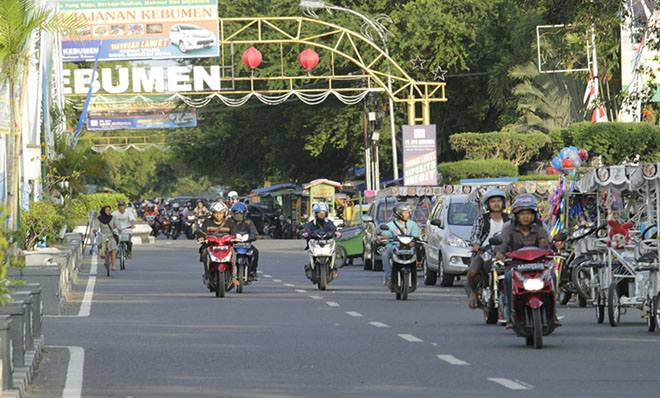

# About me

## Born

On October 9, 1996, I was born in Kebumen, a small town in Central Java, Indonesia. A few days after that I was taken to Jakarta, the capital of Indonesia. Even though I was born in Java, I can't speak Javanese. Yes, sometimes I understand it a little. Only a few words and terms. According to the [Javanese calendar](https://en.wikipedia.org/wiki/Javanese_calendar), I was born on Wednesday-Pahing. The [meaning](https://primbonmu.com/weton-rabu-pahing/) of my birth day is my character like water.

